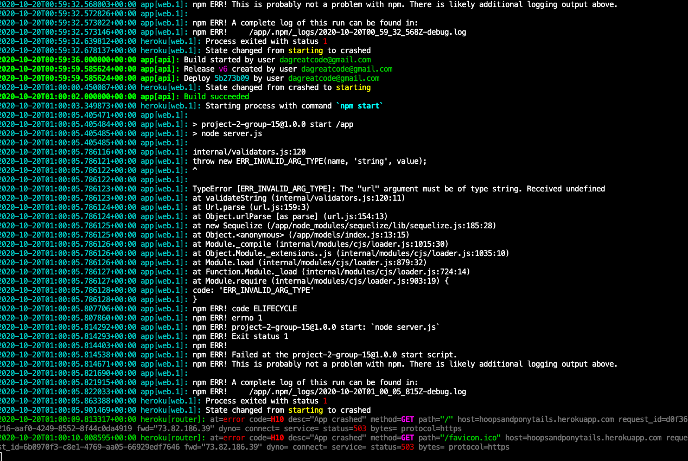
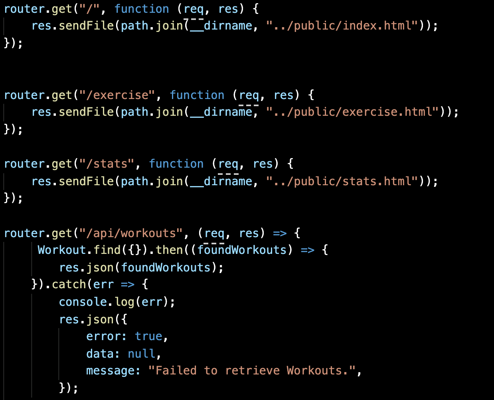
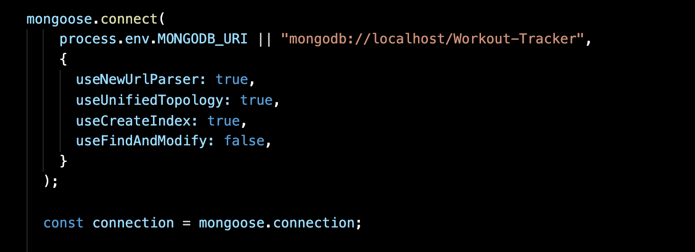
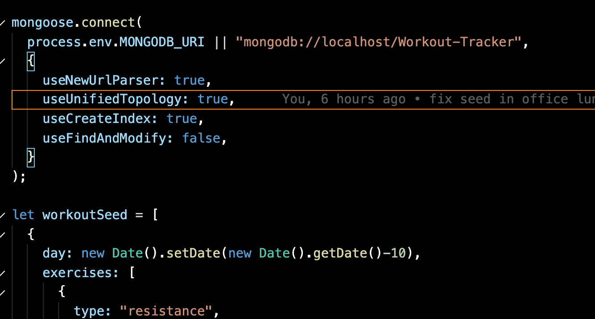
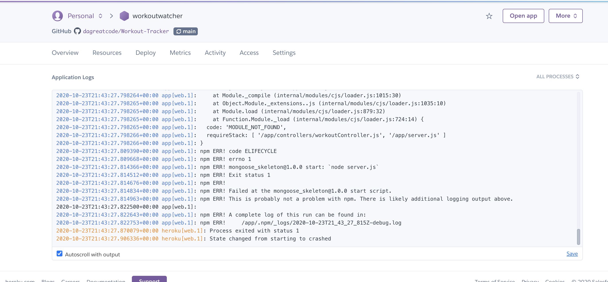
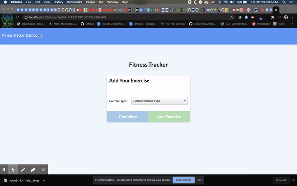

# Workout-Tracker

This err was great until i could not pass it. but i seemed to make more and more progress.

I make sure there was no err

Heroku was the part i had nothing but problems.

# I got so much help and still get these errors.

Over all, this was a ok Homework.

Here is a video showing it works great on local host but not heroku.

https://drive.google.com/file/d/16YfFVEiWBYHLvF9wdZQHcJCm56iyxB3k/view

# Then this happens. 

Heroku work fine.. I had to fix my username in my data base....
So now it is 100% deployed. DONE!!!!